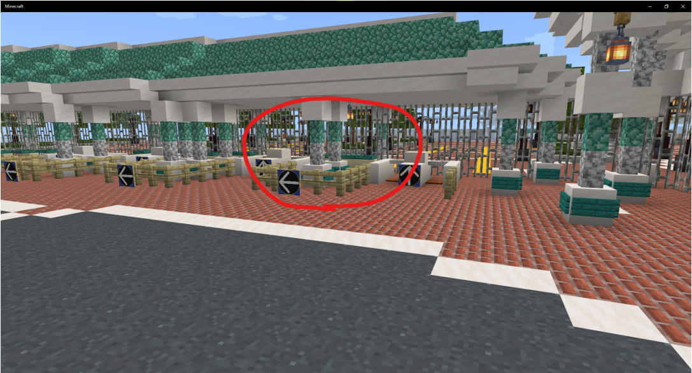
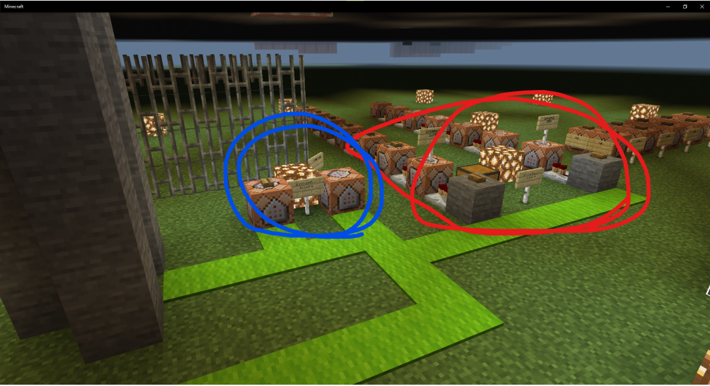
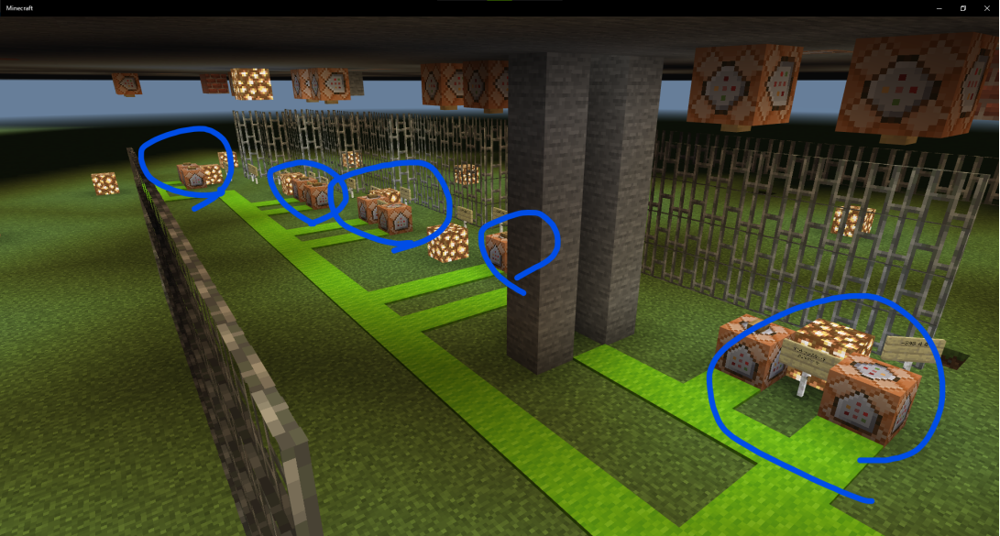

.. _operation:

============================================
E.A.C.M (Entrance Attraction Control Manual)
============================================

.. contents:: 目次
  :local:
  :depth: 2

エントランスの開閉
==================

ランド
------

+------------+--------+
| **担当者** | Keitan |
+------------+--------+

.. hint:: 

  2022年春企画ではエントランスのシャッターのみ開閉

1. ランドエントランス中央 パーク側右から1つ目の場所に地下に通じる梯子を下る．

2. コマンドブロックのボタンを操作する．

  +--------------------------------------+----------------------------------------+
  | **下図の赤く囲ったコマンドブロック** | シャッターの開閉                       |
  +--------------------------------------+----------------------------------------+
  | **下図の青く囲ったコマンドブロック** | 番号に該当する各ゲートの通行方向を指定 |
  +--------------------------------------+----------------------------------------+

シー
----

1. シーエントランス ノースゲート(駅から火山方向を向いたときに右側のゲート) のミラコスタに一番近い柱付近にある地下へ通じる梯子を下る．

2. ボタンでシャッターの開閉が行える．

